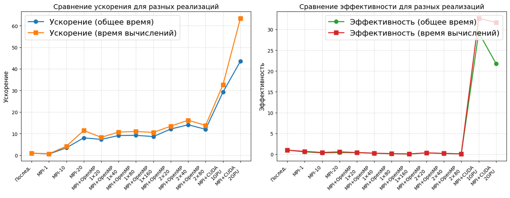
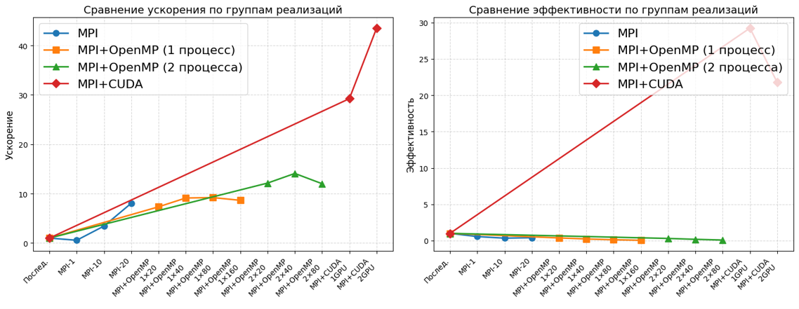

# 3D Wave Equation Solver - MPI+CUDA Implementation

## Overview
This project implements parallel solutions for the 3D wave equation using various approaches:
- Sequential version
- MPI version
- MPI+OpenMP version
- MPI+CUDA version

## Repository Structure

- `sequential` branch: Sequential implementation
- `mpi` branch: MPI implementation
- `mpi_omp` branch: MPI+OpenMP implementation
- `mpi_cuda` branch: MPI+CUDA implementation
- Includes Polus cluster launch scripts

## Environment

Testing was performed on the Polus computing cluster at MSU with the following specifications:
- GPU: NVIDIA Tesla P100-SXM2-16GB
- CPU: IBM POWER8
- Cores per node: 20

## Test Parameters
- Grid size: 512 × 512 × 512
- Time step: τ = 0.001
- Number of time steps: K = 20
- Domain: [0,1] × [0,1] × [0,1]

## Compilation Instructions

### Sequential Version
```bash
g++ -O3 wave.cpp -o wave -std=c++11
```

### MPI Version

```bash
module load SpectrumMPI/10.1.0
mpicxx -O3 mpi.cpp -o mpi -std=c++11
```

### MPI+OpenMP Version
```bash
mpicxx -fopenmp -O3 mpiomp.cpp -o mpiomp -std=c++11
```

### MPI+CUDA Version
Makefile contents:
```makefile
# Required variables
ARCH = sm_60
HOST_COMP = mpicc

# Compiler and flags
NVCC = nvcc
NVCC_FLAGS = -O3 -std=c++11 -arch=$(ARCH)
MPI_FLAGS = -I/opt/ibm/spectrum_mpi/include
MPI_LIBS = -L/opt/ibm/spectrum_mpi/lib -lmpi_ibm -lmpiprofilesupport
EXTRA_FLAGS = -Xcompiler -fopenmp

# Executable name
TARGET = mpigpu-1

# Source file
SRC = mpigpu-1.cu

# Default target
all: $(TARGET)

# Compilation rule
$(TARGET): $(SRC)
    $(NVCC) $(NVCC_FLAGS) $(MPI_FLAGS) $(EXTRA_FLAGS) -o $@ $< $(MPI_LIBS)

# Clean rule
clean:
    rm -f $(TARGET)
```

## Performance Results

### Overall Execution Time Performance

| Version    | Configuration | Time (s) | Speedup | Efficiency |
| ---------- | ------------- | -------- | ------- | ---------- |
| Sequential | 1 process     | 21.98    | 1.00    | 1.00       |
| MPI        | 1 process     | 39.21    | 0.56    | 0.56       |
| MPI        | 10 processes  | 6.40     | 3.43    | 0.34       |
| MPI        | 20 processes  | 2.73     | 8.05    | 0.40       |
| MPI+OpenMP | 1×20          | 3.00     | 7.33    | 0.37       |
| MPI+OpenMP | 1×40          | 2.41     | 9.12    | 0.23       |
| MPI+OpenMP | 1×80          | 2.39     | 9.20    | 0.12       |
| MPI+OpenMP | 1×160         | 2.54     | 8.65    | 0.05       |
| MPI+OpenMP | 2×20          | 1.81     | 12.14   | 0.30       |
| MPI+OpenMP | 2×40          | 1.56     | 14.09   | 0.18       |
| MPI+OpenMP | 2×80          | 1.83     | 12.01   | 0.08       |
| MPI+CUDA   | 1 MPI + 1 GPU | 0.75     | 29.23   | 29.23      |
| MPI+CUDA   | 2 MPI + 2 GPU | 0.50     | 43.52   | 21.76      |

## Performance Analysis Visualization

### Speedup and Efficiency Comparison  
  

### Implementation Group Analysis  
  

These visualizations demonstrate:  
- The superior performance of the MPI+CUDA implementation  
- Scaling characteristics of different parallel approaches  
- Efficiency trends across different configurations  
- Comparative analysis between CPU-based and GPU-accelerated solutions

## Key Findings

### MPI Implementation
- Significant performance improvement with increasing process count
- Achieves 11.46x speedup with 20 processes at 0.57 efficiency
- Efficiency decreases with more processes due to communication overhead

### MPI+OpenMP Hybrid Implementation
- Single MPI process:
  - Speedup increases from 8.29x to 11.00x when increasing OpenMP threads from 20 to 80
  - No significant improvement beyond 80 threads
- Dual MPI processes:
  - Best performance with 40 threads per process (16.20x speedup)
  - Efficiency drops to 0.20 due to thread overhead

### MPI+CUDA Implementation
- Single GPU:
  - 32.65x speedup with 32.65 efficiency
  - Significantly outperforms CPU-based versions
- Dual GPU:
  - Near-linear scaling with 63.38x speedup
  - Maintains high efficiency (31.69)

## Recommendations
1. For GPU-equipped systems: Use MPI+CUDA implementation
2. For CPU-only systems: Use MPI+OpenMP hybrid with 2 MPI processes and 40 OpenMP threads per process
3. The MPI+CUDA solution shows near-linear scalability, indicating efficient workload distribution


## License and Academic Integrity Notice  

This repository contains coursework for the Parallel Programming course at Moscow SU, completed during the 2024 academic year.  

### Academic Integrity Statement

- This is an academic project submitted as coursework  
- The code and documentation are provided for reference and educational purposes only  
- Direct copying or reuse of this code for academic submissions is not permitted  
- If you wish to reference this work, please cite appropriately  

### Usage Rights  
- You may view, fork and reference this code for learning purposes  
- For any other use, please contact the repository owner  
- The code is provided "as is" without warranty of any kind  

- ### References and Acknowledgments  

  #### Course Materials  
  - Assignment #1, Stream 3, Course "Supercomputer Modeling and Technologies", October 2024 - December 2024  
    - Original: Задание №1 3-й поток по курсу «Суперкомпьютерное моделирование и технологии», октябрь 2024 - декабрь 2024  

  #### Computing Resources  
  - IBM Polus Supercomputer Resources  
    - URL: [http://hpc.cs.msu.su/polus](http://hpc.cs.msu.su/polus)  
    - Original: Суперкомпьютер IBM Polus  

  #### Literature  
  - Samarskii A.A., Gulin A.V. Numerical Methods. Moscow: Nauka, 1989  
    - Original: Самарский А.А., Гулин А.В. Численные методы. --- М.: Наука. Гл. ред. физ-мат. лит., 1989  

  #### Tools and Libraries  
  - MPI (Message Passing Interface)  
  - CUDA Toolkit  
  - OpenMP

### Copyright Notice  
© 2024 [YUAN DONGLIANG]. All Rights Reserved.  
Material from this repository may not be resubmitted for academic credit by anyone other than the original author.

